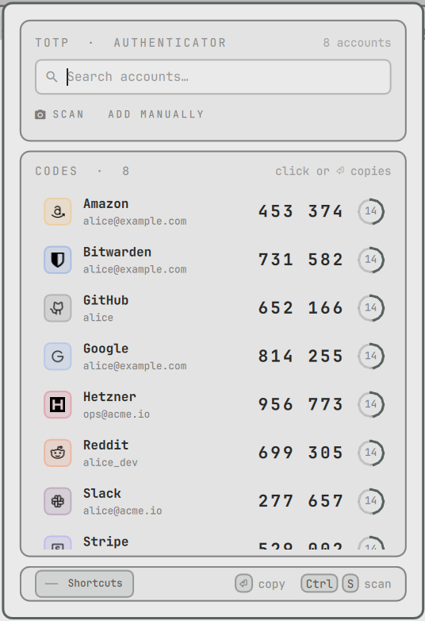

<div align="center">

# Sesame

**Two-factor codes in the Omarchy bar.**
Your TOTP accounts with live codes, one keystroke from the clipboard — and a
webcam scanner, so adding an account means holding your phone up to the laptop.

`de.gransoftware.sesame`&nbsp;&nbsp;·&nbsp;&nbsp;&nbsp;&nbsp;&nbsp;



<sub>Sesame follows the active Omarchy theme.</sub>

</div>

---

## Features

- **Bar icon and popup.** Type to filter, `Enter` copies the code.
- **Webcam QR scanning.** Reads normal `otpauth://` codes and Google
  Authenticator exports with many accounts in one QR.
- **Add by hand** with a form, or paste an `otpauth://` URL.
- **Encrypted store.** AES-256-GCM, key kept in your login keyring.
- **Clean clipboard.** A copied code is marked sensitive, so clipboard managers
  skip it, and it is cleared after 30 seconds.
- **Offline.** No network requests, ever. Brand icons ship with the plugin.

## Install

First install three packages from the Arch repos — `python-cryptography`,
`libsecret` and `zbar` — with the Omarchy menu (Install › Package) or your usual
package tool. Sesame never installs anything itself; it tells you if one is
missing.

Then add the plugin and put it in the bar:

```bash
omarchy plugin add https://github.com/gran-software-solutions/sesame-omarchy-plugin.git --yes
omarchy plugin enable de.gransoftware.sesame --section right
```

Optional — bind a key in `~/.config/hypr/bindings.lua`:

```lua
o.bind("SUPER + ALT + T", "Sesame", "omarchy-shell de.gransoftware.sesame toggle")
```

The plugin never touches your configuration itself.

### Dependencies

| Package | Used for |
|---------|----------|
| `python-cryptography` | encrypting the store |
| `libsecret` (`secret-tool`) | keeping the store key in GNOME Keyring |
| `zbar` (`zbarimg`) | reading QR codes |
| `wl-clipboard` | copying codes — ships with Omarchy |

The scanner also needs your user in the `video` group and Qt 6 Multimedia; both
are Omarchy defaults.

### Update and remove

```bash
omarchy plugin update de.gransoftware.sesame
omarchy plugin remove de.gransoftware.sesame
```

Removing the plugin keeps your accounts, so a reinstall finds them again. To
delete them for good:

```bash
gio trash ~/.config/sesame
secret-tool clear application sesame purpose store-key
```

## Keys

| Key | Action |
|-----|--------|
| type | Filter by issuer or account |
| `↑` `↓` · `Ctrl+J` `Ctrl+K` | Move through the list |
| `Enter` | Copy the selected code |
| `Ctrl+S` | Open the webcam scanner |
| `Ctrl+N` | Add an account by hand |
| `Ctrl+R` | Refresh codes |
| `Delete` (empty search) · `Shift+Delete` | Remove the account — asks first, Cancel is the default |
| `Esc` | Clear the filter, go back, or close |

In the scanner, `Enter` stores the account that was found and `Esc` discards
it. Hover the footer for the full list.

## Settings

`omarchy plugin settings de.gransoftware.sesame`

| Key | Default | Meaning |
|-----|---------|---------|
| `icon` | shield-key glyph | Nerd Font glyph or hex codepoint for the bar |
| `clipboardClearSeconds` | `30` | Clear the copied code after this many seconds (0 = never) |
| `closeOnCopy` | `true` | Close the popup after copying |
| `mirrorPreview` | `true` | Selfie-style camera preview |

## Security

What Sesame does:

- **Secrets are encrypted on disk.** `~/.config/sesame/store.json` is an
  AES-256-GCM envelope, mode `0600` in a `0700` folder, written atomically.
- **The key is not in the file.** A random 32-byte key is made on first use and
  kept in GNOME Keyring. It unlocks with your login.
- **Secrets stay in the backend.** The popup only gets names and the current
  codes. A secret you type goes to the backend over stdin, never as a command
  argument.
- **Camera frames are private and short-lived.** A frame is a picture of your
  secret. It is written to `$XDG_RUNTIME_DIR` (memory only, readable by you
  alone), decoded, and deleted. It never goes to `/tmp`.
- **Copied codes are marked sensitive** (`wl-copy --sensitive`), so clipboard
  history tools that respect the hint do not record them.
- **No network.** Nothing is fetched at run time.

What it cannot do:

- While you are logged in, the keyring is unlocked, so **any program running as
  your user can read the key and the store.** This is true of every desktop
  authenticator without a hardware key. Sesame protects against a stolen disk
  or a leaked backup of `~/.config` — not against malware on your account.
- `bin/totp export` prints your secrets in plain text. That is its job; keep
  the output safe.
- Keeping 2FA codes on the same machine as your passwords is less safe than
  keeping them on a separate phone. Decide what fits you.

Like every Omarchy plugin, Sesame runs unsandboxed inside `omarchy-shell`. Read
the source before you enable it.

<details>
<summary><b>Command line</b></summary>

<br>

The backend works on its own:

```bash
T=~/.config/omarchy/plugins/de.gransoftware.sesame/bin/totp
$T list                                # JSON with current codes
$T add                                 # interactive
printf '%s' 'otpauth://totp/...' | $T add --stdin
$T decode photo.png [--add]            # read QR codes from an image
$T export > backup.txt                 # otpauth:// URLs in plain text — keep it safe
$T import backup.txt                   # or a flathack.otp accounts.json
$T status                              # dependency and store check
```

</details>

<details>
<summary><b>How it works</b></summary>

<br>

| File | Role |
|------|------|
| `manifest.json` | Plugin manifest: bar widget, settings schema |
| `Panel.qml` | Bar icon, popup, list / scan / confirm / manual modes, IPC handler |
| `ScanPane.qml` | Webcam viewfinder; captures a frame every 450 ms |
| `ThemePalette.qml` | Reads the active theme's `colors.toml` for hues the shell does not expose |
| `BrandIcons.js` | Issuer name → brand mark and brand colour |
| `brands/` | Brand SVGs, with `SOURCES.md` listing upstream and licence per file |
| `bin/totp` | Python backend: store, TOTP, QR decoding, clipboard |
| `tests/test_totp.py` | Backend tests against a temp store and a throwaway key |
| `fetch_brands.py` | Developer-only script that downloaded `brands/`; the plugin never runs it |

Each row shows the service's brand mark in its own colour when one ships in
`brands/`, and the issuer's initial in a theme colour when not. Everything else
— colours, corner radius, hover and focus states — comes from the active
Omarchy theme.

IPC: `omarchy-shell de.gransoftware.sesame toggle | open | close | scan`.

</details>

<details>
<summary><b>Development</b></summary>

<br>

```bash
mise run link        # symlink this checkout into the plugins folder
mise run check       # validate manifest, qmllint, backend tests
```

Edits hot-reload in the shell. To add a brand: drop the SVG in `brands/`, then
add a row to `ICONS` and `BRAND_COLORS` in `BrandIcons.js`.

</details>

## Vibe-coded

Every line of this plugin was written by [Claude](https://claude.com/claude-code)
from conversational prompts. For software that holds your 2FA secrets, that is
one more reason to read the source first.

## License

[MIT](LICENSE) © Gran Software Solutions

Brand marks from [Phosphor Icons](https://phosphoricons.com) (MIT) and
[Simple Icons](https://simpleicons.org) (CC0) — see
[`brands/SOURCES.md`](brands/SOURCES.md) and [`brands/LICENSE`](brands/LICENSE). The marks remain trademarks of their
owners.
